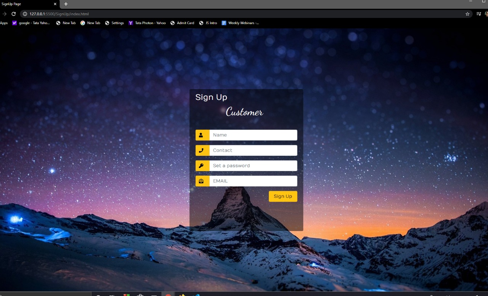
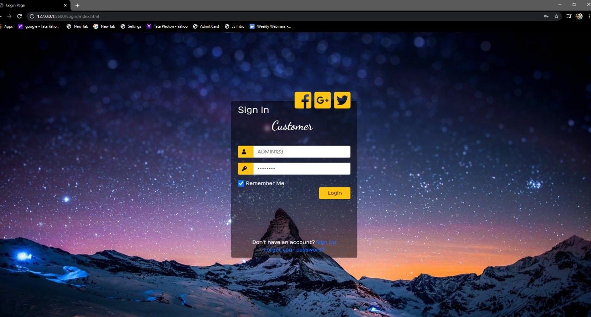
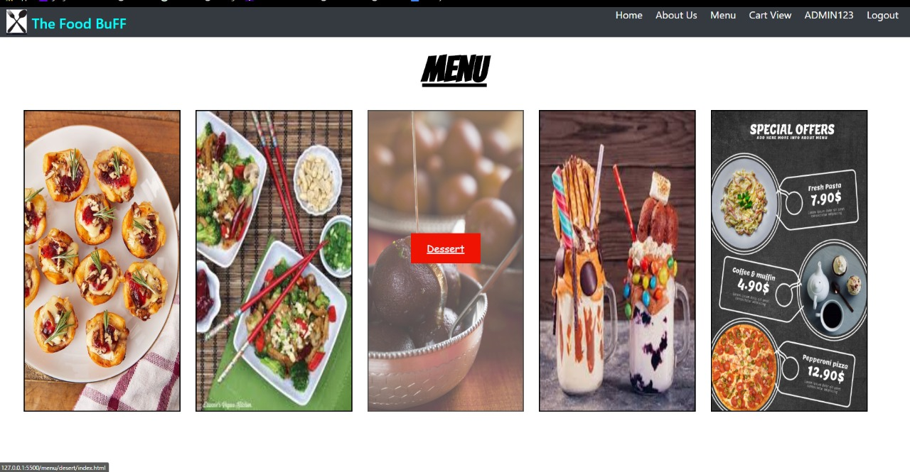
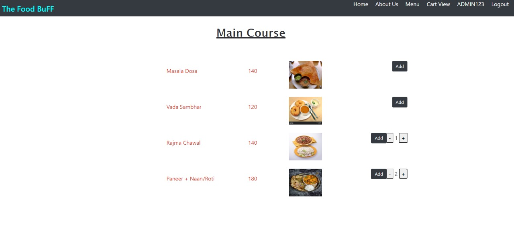
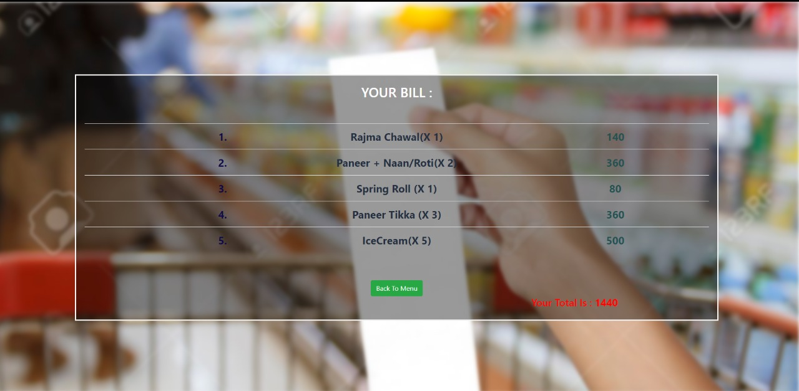

#                                                                      Online Food Delivery Project
This Repository consists code of my first Web Development Project built jointly with Vaibhav Varshney(https://github.com/VAIBHAV189)
The project is on a food ordering website.

#      HOME PAGE

Features included : 
#      1. User SignUp 

#      2. Login (Using Passport Strategy)

#      3. Menu 

#      4. Cart(For Items Selected for Order)

# Technology Stack : 
    FrontEnd : HTML,CSS+BootStrap,JS
    BackEnd : NodeJS,SQLITE
    

    

